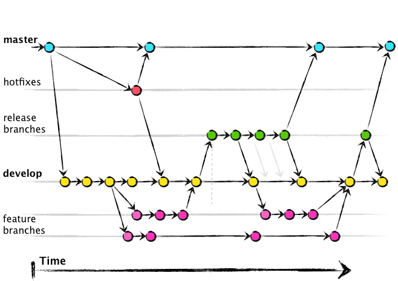
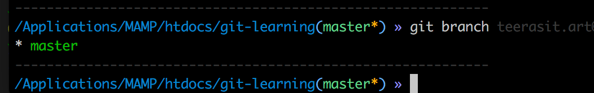

# git-learning

## …or create a new repository on the command line
```
echo "# git-learning" >> README.md
git init
git add README.md
git commit -m "first commit"
git remote add origin https://github.com/chiipzaa/git-learning.git
git push -u origin master
```

## ประโยชน์ของการใช้ git เพื่อ version control ของ project งาน


## ตัวอย่างการใช้งาน โดยใช้ project.php เป็นตัวอย่าง

> คำสั่งตรวจสอบว่าปัจจุบันอยู่ที่ branch ไหน
```
git branch
```


> คำสั่งสร้าง branch ชื่อว่า "hotfixes" และเปลี่ยนไปยัง branch ที่สร้างทันที
```
git checkout -b hotfixes
```
> ถ้าหากต้องการออกจาก branch แล้วกลับมายัง master branch
```
git checkout master
```
