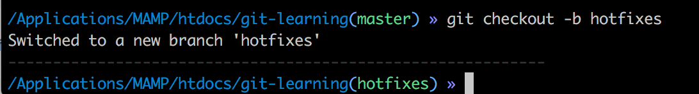

# git-learning

## …or create a new repository on the command line
```
echo "# git-learning" >> README.md
git init
git add README.md
git commit -m "first commit"
git remote add origin https://github.com/chiipzaa/git-learning.git
git push -u origin master
```

## ประโยชน์ของการใช้ git เพื่อ version control ของ project งาน


## ตัวอย่างการใช้งาน โดยใช้ project.php เป็นตัวอย่าง

> คำสั่งตรวจสอบว่าปัจจุบันอยู่ที่ branch ไหน
```
git branch
```


> คำสั่งสร้าง branch ชื่อว่า "hotfixes" และเปลี่ยนไปยัง branch ที่สร้างทันที
```
git checkout -b <new branch>
```

หลังจากนั้นให้ลองไปแก้ไข code ต่าง
หลังจากนั้น ก็ให้ commit และ push ขึ้นไป
```
git push origin <branch>
```

> อัฟโหลด to branch
```
git push origin hotfixes
```
จะเห็นว่า เรามีการแก้ไข เพิ่ม code ใหม่แล้วใน branch hotfixes แต่ใน branch master เราจะเห็น code เท่าเดิมตลอด

> ถ้าหากต้องการออกจาก branch แล้วกลับมายัง master branch
```
git checkout master
```
ถ้าหาก เราลอง switch ไปมา ระหว่าง branch จะเห็นว่ามี code ที่เปลี่ยนแปลงตามการแก้ไขในแต่ละ branch

> ถ้าต้องการ merge การเปลี่ยนแปลงจาก branch อื่น มายัง branch ปัจจุบัน (เช่น master) ด้วยคำสั่ง
```
git merge <branch>
```
